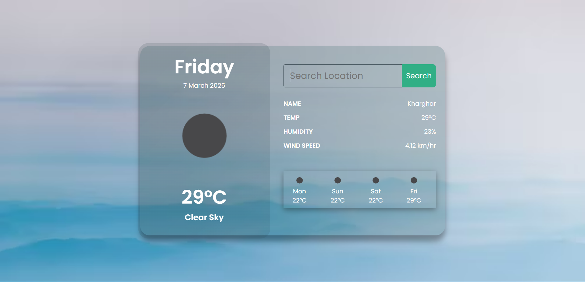
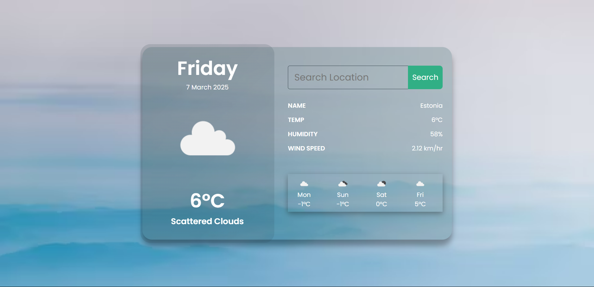

# Weather App

Welcome to the Weather App! This application provides real-time weather updates for any city using the OpenWeather API. It is built using basic web technologies: HTML, CSS, and JavaScript.

## About & Features

This app fetches real-time weather data using API integration and presents key weather details such as temperature, humidity, wind speed, and overall conditions. Users can search for any city worldwide and get instant weather updates. The app is designed to be responsive and optimized for both desktop and mobile devices.

## Technologies Used

- **HTML5** for structure
- **CSS3** for styling and layout
- **JavaScript** for interactivity and API integration
- **OpenWeather API** for fetching real-time weather data

## How to Use

1. Clone the repository:
   ```sh
   git clone https://github.com/Jynxxor/Weather_App.git
   ```
2. Navigate to the project directory:
   ```sh
   cd Weather_App
   ```
3. Open `index.html` in your browser.

## Configuration

To use the OpenWeather API, you need an API key:

1. Sign up at [OpenWeather](https://openweathermap.org/) and get your API key.
2. Replace `API` in the JavaScript file with your actual API key:
   ```js
   const API = 'YOUR_API_KEY';
   ```

## Contributing

Contributions are welcome! If you find any bugs or have suggestions for improvements, feel free to fork the repository and submit a pull request.

## Live Demo

Check out the live version of the app here: [Weather Web App](https://jynxxor.github.io/Weather_App/)

## Project Screenshots

Here are some screenshots of the project:

  


&#x20;

---

Made with ❤️ by [Jayesh](https://github.com/Jynxxor)

